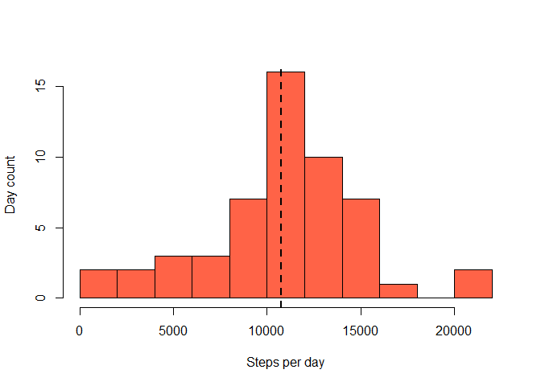
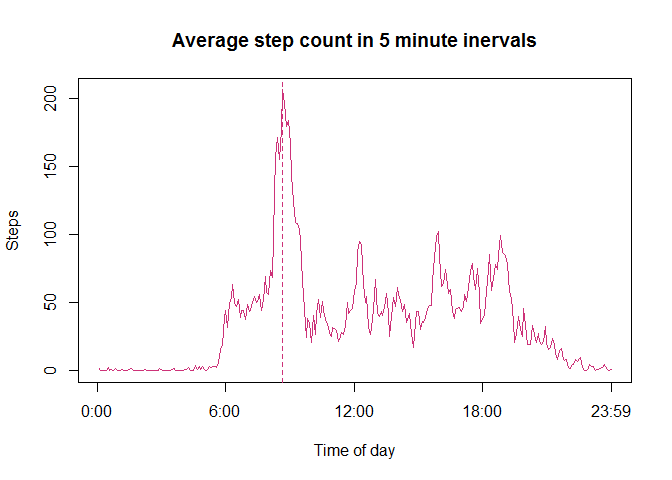
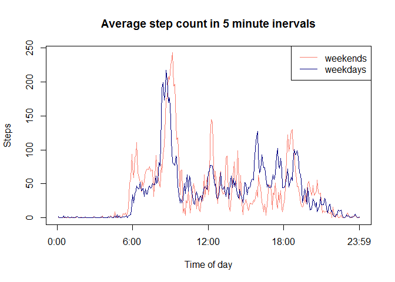

# Reproducible Research: Peer Assessment 1


## Loading and preprocessing the data

```r
unzip("activity.zip")
activity = fread('activity.csv')
```

## What is mean total number of steps taken per day?

```r
stepsbyday = 
    activity %>% group_by(date) %>% summarize(steps = sum(steps))

meansteps = as.character(round(mean(stepsbyday$steps, na.rm = TRUE))) # remove as.character and it breaks!?
mediansteps = median(stepsbyday$steps, na.rm = TRUE)
meansteps
```

```
## [1] "10766"
```

```r
mediansteps
```

```
## [1] 10765
```

```r
hist(stepsbyday$steps, breaks = 14, 
     xlab = 'Steps per day', ylab = 'Day count', main = '', col = 'tomato')

abline(v = mediansteps, lwd = 2, lty = 2)
```

 

The mean of steps taken per day is 10766 and the median is 10765.

## What is the average daily activity pattern?

Getting average step count per intrval is straightforward enough...

```r
stepsbyinterval = 
    activity[!is.na(activity$steps)] %>% 
    group_by(interval) %>% 
    summarize(steps = mean(steps))  %>%
    mutate(sequence = 1:288)
```

...but some manual processing is needed to to get the time intervals right. Note that coercing intervals to numbers leaves 'gaps' between 55 and 99 minute values, so instead a simple sequence is used for plot X-axis and is labeled by hand with correct hours.

```r
plot(stepsbyinterval$sequence, stepsbyinterval$steps, type = 'l', 
     main = 'Average step count in 5 minute inervals', 
     xlab = 'Time of day', ylab = 'Steps', 
     col = 'violetred3',
     axes = FALSE)

axis(1, labels = c('0:00','6:00','12:00','18:00','23:59'), at = c(0, 72, 144, 216, 288))
axis(2)
box()

maxstepsplot = stepsbyinterval$sequence[which.max(stepsbyinterval$steps)]
abline(v = maxstepsplot, lty = 2, col = 'violetred3')
```

 

```r
maxstepsvalue = as.character(stepsbyinterval$interval[which.max(stepsbyinterval$steps)])
```

The maximum ofsteps are on average made at 835.

## Imputing missing values

```r
fillednas = activity

for (i in 1:dim(fillednas)[1]){
    if (is.na(fillednas$steps[i])) {
        fillednas$steps[i] = stepsbyinterval$steps[stepsbyinterval$interval == fillednas$interval[i]]
    }
}

stepsbyday2 = 
    activity %>% group_by(date) %>% summarize(steps = sum(steps))

hist(stepsbyday2$steps, breaks = 14, 
     xlab = 'Steps per day', ylab = 'Day count', main = '', col = 'tomato')

meansteps2 = as.character(round(mean(stepsbyday2$steps, na.rm = TRUE)))
mediansteps2 = median(stepsbyday2$steps, na.rm = TRUE)
abline(v = mediansteps2, lwd = 2, lty = 2)
```

 

```r
if (identical(meansteps, meansteps2) & identical(mediansteps, mediansteps2)) {
    effect = 'no effect'
} else {
    effect = 'an effect'
}
```

The mean of steps taken per day is 10766 and the median is 10765. Filling in the missing values has no effect on the mean and median compared to the original dataset.

## Are there differences in activity patterns between weekdays and weekends?
Using the dataset with NAs substituted by interval averages. Let's split it into weekday and weekend day groups and calculate interval averages for each. We'll also generate a 1:288 sequence to use for plot X-axis like before.

```r
differences = fillednas
differences$day = weekdays(strptime(differences$date, format='%Y-%M-%d'))
differences$weekend = 0

for (i in 1:dim(differences)[1]) {
    if (differences$day[i] == 'Saturday' | differences$day[i] == 'Sunday') {
        differences$weekend[i] = 1
    }
}

weekends = differences %>%
    select(interval, date, steps, weekend) %>%
    filter(weekend == 1) %>%
    group_by(interval) %>%
    summarize(steps = mean(steps)) %>%
    mutate(sequence = 1:288)

weekdays = differences %>%
    select(interval, date, steps, weekend) %>%
    filter(weekend == 0) %>%
    group_by(interval) %>%
    summarize(steps = mean(steps)) 

plot(weekends$sequence, weekends$steps, type = 'l', 
     main = 'Average step count in 5 minute inervals', 
     xlab = 'Time of day', ylab = 'Steps', 
     col = 'salmon',
     axes = FALSE)

axis(1, labels = c('0:00','6:00','12:00','18:00','23:59'), at = c(0, 72, 144, 216, 288))
axis(2)
box()

lines(weekends$sequence, weekdays$steps, col = 'navy')
legend('topright', legend = c('weekends','weekdays'), col = c('salmon','navy'), lwd = 1)
```

 

Looking at the graph it seems the walking patterns are quite similar between weekdays and weekends. Just to get some metric on this, let's calculate correclation.

```r
cor(weekends$steps, weekdays$steps)
```

```
## [1] 0.6900344
```
